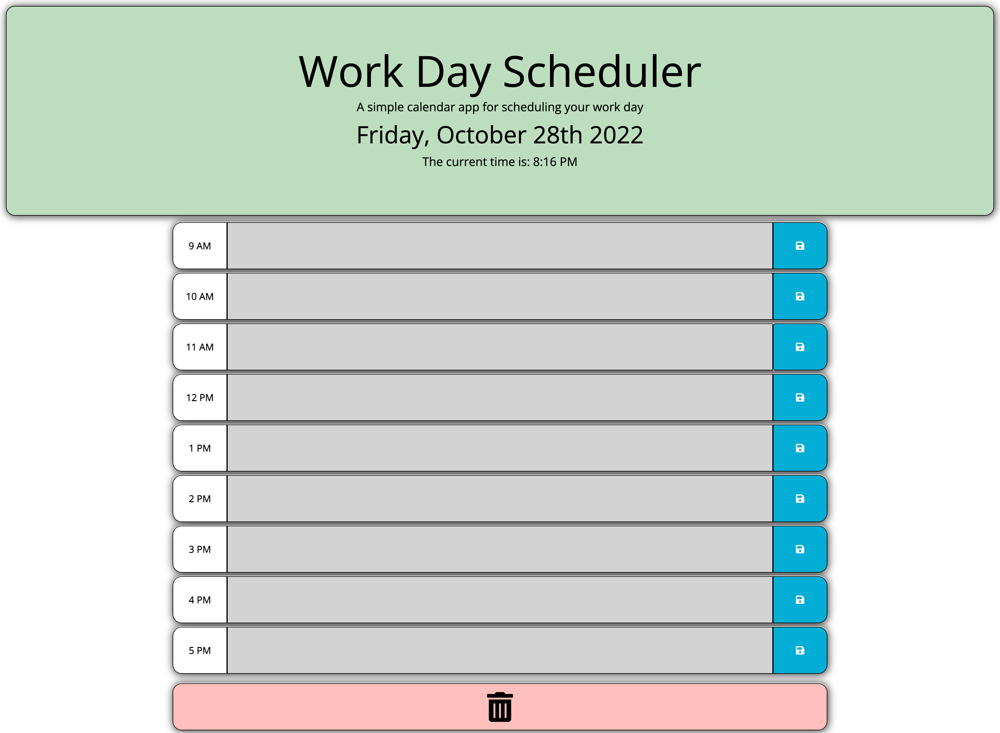

# Daily-Work-Planner

## 💡 Description

This project is a daily work planner to help organize your day. Creating this project helped me understand the streamlining features of JQuery & Moment. Overall I believe the skills need to create this program helped further my knowledge of Moment specifically the multiple time and date formats that can be used. Going forward I can see how these features could be implemented into a wider range of project concepts.

## ✔️ Usage

- Enter event detail into the allocated time area.
- Click save button to save event details. This will save the event to local storage.
- Text areas will change color depending on the current time. Grey - Past, Red - Present, Green - Future.

## 🔗 Links

[Deployed Webpage](https://steven-mccombe.github.io/daily-planner/)

## 📸 Screenshot

## 📝 License

MIT license
